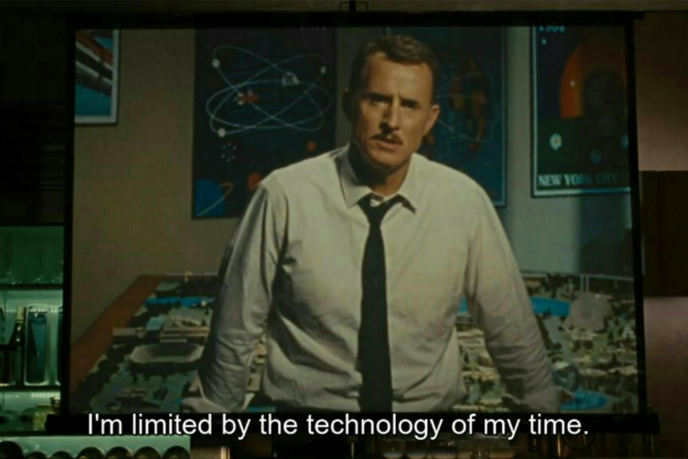

# seq2seq

Sequence to Sequence translation using encoder-decoder model

## Requirements

- Python 3.11
- PyTorch 2.1.0
- Matplotlib 2.2.2

## Dataset

The dataset used for training and testing is a small dataset of 8000 sentences. The dataset is divided into 7000 sentences for training and 1000 sentences for testing.
Each input sequence is a sentence of 8 words and each output sequence is a sentence of 8 words in a different language.
Each word is represented by a letter and can easily be replaced to any word of any language.

## Description

The project consists of Language translation using encoder-decoder model. The encoder is a GRU and the decoder is a unidirectional GRU with teacher forcing. Teacher forcing is a technique where the target word is passed as input to the decoder at the next time step to improve the performance of the model.
The model is trained on a small dataset of 7000 sentences. The model is trained on a GPU and the training time is around 2 hours. The model is tested on a test set of 1000 sentences. The model is able to predict all of the sentences correctly in the training set. The model is able to predict sentences of test set with 50% accuracy.

The model needs to be trained using multiple GPUs for more epochs to improve the performance of the model.

A pre-trained model is provided in the repository. The model was trained using L2 regularization and multiple optimizers such as:

- Adam
- AdamW
- RMSprop
- SGD
